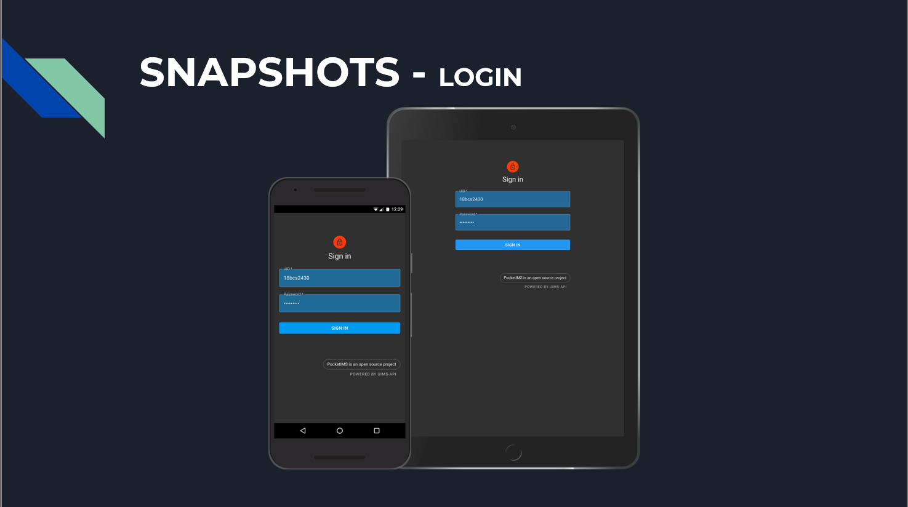
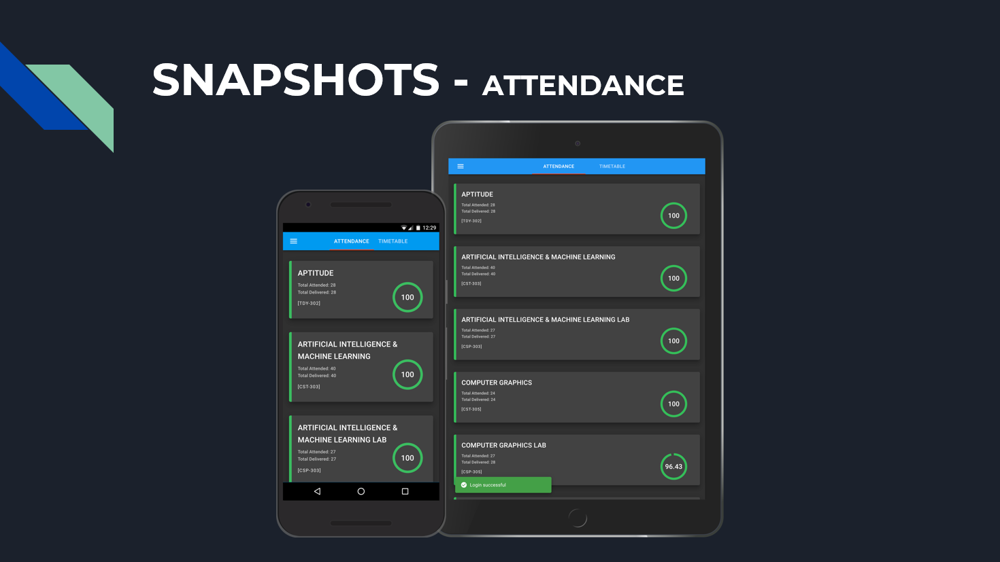
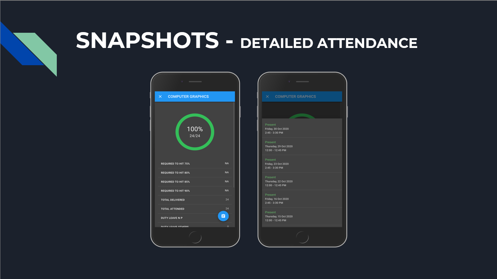
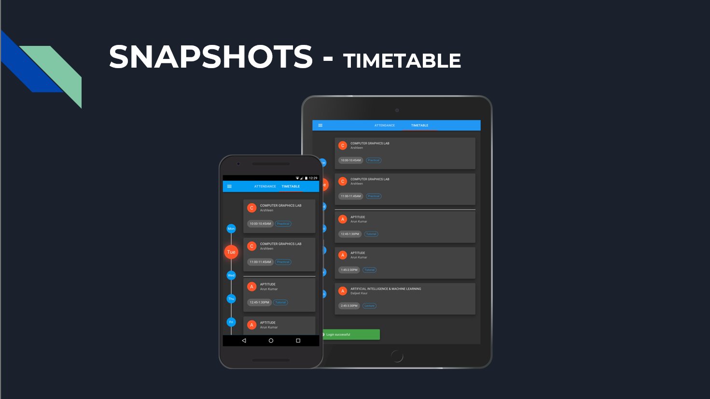

# Pocket IMS

Better UIMS, build with python, react

## Building

**Npm, Python3** is required

```bash
$ git clone https://github.com/xpt1x/PocketIMS.git
$ cd PocketIMS
# building backend
# install required pip modules
$ pip install -r requirements.txt
# install local api module
$ pip install -e .
# running backend server
$ cd frontend
$ npm install
$ npm run start
$ cd ..
$ export FLASK_APP=application.py
$ flask run
```
# Screenshots
</img>
</img>
</img>
</img>
